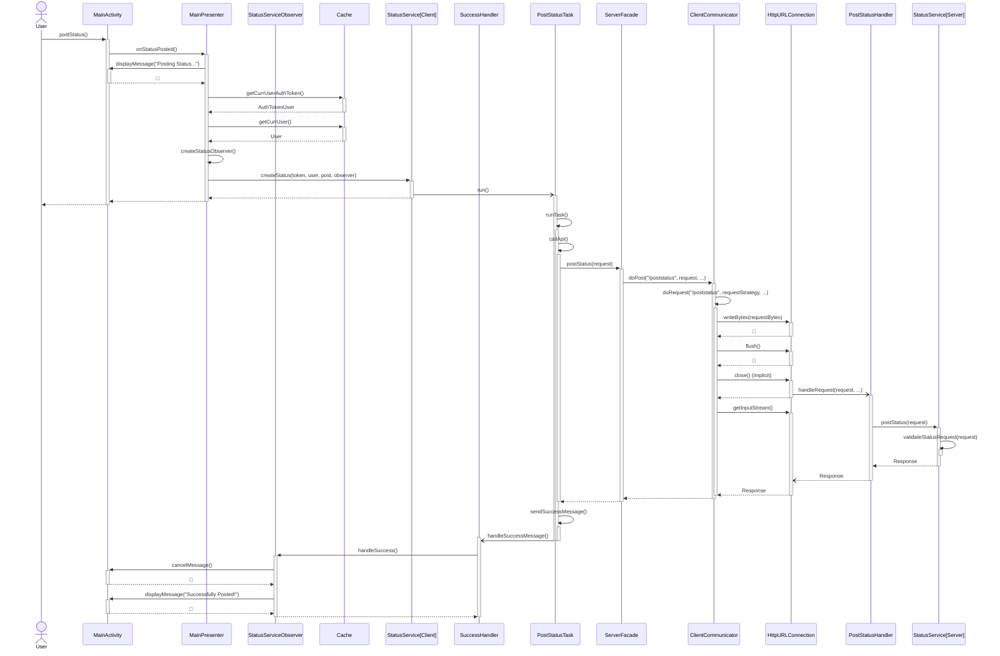

# UML Diagram Thingy

```mermaid
sequenceDiagram

actor User

participant MainActivity
participant MainPresenter
participant StatusServiceObserver
participant Cache
participant StatusService[Client]
participant SuccessHandler
participant PostStatusTask

User ->>+ MainActivity : postStatus()
MainActivity ->>+ MainPresenter : onStatusPosted()
MainPresenter ->>+ MainActivity : displayMessage("Posting Status...")
MainActivity -->>- MainPresenter : 
MainPresenter ->>+ Cache : getCurrUserAuthToken()
Cache -->>- MainPresenter : AuthTokenUser
MainPresenter ->>+ Cache : getCurrUser()
Cache -->>- MainPresenter : User
MainPresenter ->> MainPresenter : createStatusObserver()
MainPresenter ->>+ StatusService[Client] : createStatus(token, user, post, observer)
StatusService[Client] -)+ PostStatusTask : run()
StatusService[Client] -->>- MainPresenter : 
MainPresenter -->>- MainActivity : 
MainActivity -->>- User : 

PostStatusTask ->>+ PostStatusTask : runTask()
PostStatusTask ->>+ PostStatusTask : callApi()
PostStatusTask ->>+ ServerFacade : postStatus(request)
ServerFacade ->>+ ClientCommunicator : doPost("/poststatus", request, ...)
ClientCommunicator ->>+ ClientCommunicator : doRequest("/poststatus", requestStrategy, ...)
ClientCommunicator ->>+ HttpURLConnection : writeBytes(requestBytes)
HttpURLConnection -->>- ClientCommunicator : 
ClientCommunicator ->>+ HttpURLConnection : flush()
HttpURLConnection -->>- ClientCommunicator : 
ClientCommunicator ->>+ HttpURLConnection : close() (implicit)
HttpURLConnection -)+ PostStatusHandler : handleRequest(request, ...)
HttpURLConnection -->>- ClientCommunicator : 
ClientCommunicator ->>+ HttpURLConnection : getInputStream()

PostStatusHandler ->>+ StatusService[Server] : postStatus(request)
StatusService[Server] ->>+ StatusService[Server] : validateStatusRequest(request)
deactivate StatusService[Server]
StatusService[Server] -->>- PostStatusHandler : Response
PostStatusHandler --)- HttpURLConnection : Response

HttpURLConnection -->>- ClientCommunicator : Response
deactivate ClientCommunicator
ClientCommunicator -->>- ServerFacade : 
ServerFacade -->>- PostStatusTask : 
deactivate PostStatusTask
PostStatusTask ->>+ PostStatusTask : sendSuccessMessage()
PostStatusTask -)+ SuccessHandler : handleSuccessMessage()
deactivate PostStatusTask
deactivate PostStatusTask
deactivate PostStatusTask

SuccessHandler ->>+ StatusServiceObserver : handleSuccess()
StatusServiceObserver ->>+ MainActivity : cancelMessage()
MainActivity -->>- StatusServiceObserver : 
StatusServiceObserver ->>+ MainActivity : displayMessage("Successfully Posted!")
MainActivity -->>- StatusServiceObserver : 
StatusServiceObserver -->>- SuccessHandler : 
deactivate SuccessHandler
```
