# UML Diagram

### Class Diagram

```mermaid
classDiagram

View <|.. StoryFragment
BasePresenter <|-- PagingPresenter~ItemType~
PagingPresenter~ItemType~ <|-- StoryPresenter
StoryFragment "1" <--> "1" StoryPresenter
StoryPresenter "1" --> "1" Cache
BaseService <|-- StatusService
StoryPresenter "1" --> "1" StatusService
StatusService "1" --> "*" GetStoryTask
GetStoryTask "1" --> "1" StatusPageHandler
StatusPageHandler "1" --> "1" PagingServiceObserver~ItemType~
ResultObserver~ResultType~ <|.. PagingServiceObserver~ItemType~
PagingServiceObserver~ItemType~ "*" --> "1" StoryPresenter


class StoryFragment {
    - StoryPresenter presenter
}

class StoryPresenter {
    - StatusService statusService

    + void onScrolled(User)
    # void loadItemsFromService(User, AuthToken)
}

class View {
    <<interface>>

    + void setLoadingFooterVisible(Boolean)
    + void displayMessage(String)
    + void cancelMessage()
    + void addItems(List<User>)
}


class PagingPresenter~ItemType~ {
    + PAGE_SIZE$
    - ItemType lastItem
    - boolean hasMorePages
    - boolean isLoading

    + void loadMoreItems(User user)
    # void loadItemsFromService(User, AuthToken)*
}

class PagingServiceObserver~ItemType~ {
    + void onResultLoaded(Pair<List<ItemType>, Boolean>)
    + void handleFailure(String)
    + void handleException(Exception)
}

class BasePresenter {
    <<abstract>>

    # View view
}

class ResultObserver~ResultType~ {
    <<interface>>

    + void onResultLoaded(ResultType)*
    + void handleFailure(String)*
    + void handleException(Exception)*
}

class Cache {
    + Cache getInstance()$
    + AuthToken getCurrUserAuthToken()
    + User getCurrUser()
}


class StatusService {
    + void loadStory(AuthToken, User, int, Status, ResultObserver~Pair~List~Status~，Boolean~~)
}

class BaseService {
    <<abstract>>

    # void executeTask(Runnable)
}

class GetStoryTask {
    - AuthToken authToken
    - User targetUser
    - Status lastItem
    - int limit
    - Handler messageHandler

    + public void run()
}

class StatusPageHandler {
    + void handleMessage(Message msg)
    # void handleSuccessMessage(ResultObserver<Pair<List<Status>, Boolean>>)
}

```



### Sequence Diagram


### Questions

> Pick one place where you used the observer pattern. Which class was the subject?

`UserService`

> Which class was the observer?

`NavigateToUserObserver`

> Which layer did the subject belong to... (Model, View, or Presenter layer)

The "Model" layer

> ...and which layer did the observer belong to? (Model, View, or Presenter layer)

The "Presenter" layer

> Pick one place where you used generics. What class was it in?

`ResultHandler<ResultType, ObserverType extends ... >`

> What classes can the generic type T be?

`ResultType` is whatever the `ResultHandler` returns; the `ObserverType` is a `ResultObserver<ResultType>`

> Pick one place where you used the template method pattern. Show the template method.

```java
protected void executeTask(Runnable task) {
    ExecutorService executor = Executors.newSingleThreadExecutor();
    executor.execute(task);
}
```

> What class is it in?

`BaseService`

> Show the step of the algorithm that is deferred to the class's subclass.

```java
public void loginUser(
    String userAlias,
    String password,
    ResultObserver<Pair<User, AuthToken>> observer
) {
    LoginTask loginTask = new LoginTask(
        userAlias,
        password,
        new UserAuthHandler(observer)
    );
    executeTask(loginTask);
}
```

> What class is it in?

`UserService`
